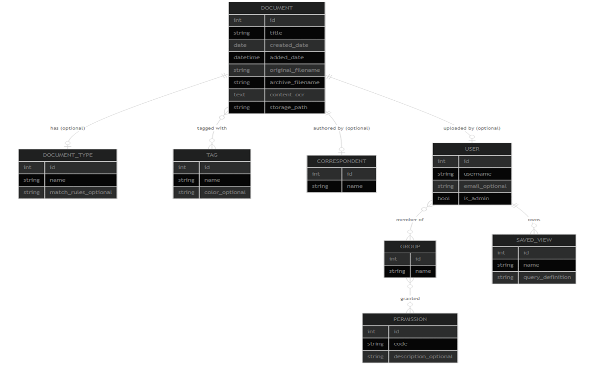

## Setup-Schritte:

- Docker-Compose file suchen: [Docker-Compose-File](../paperless-schule/docker-compose.yml)
  
- Diese dann verwenden und die Webseite öffnen
  
- Auf der Webseite Nutzer anlegen (Uploader und Admin)
  
- Berechtigungen verteilen (Admin bekommt alle Rechte & Uploader darf nur dateien hochladen)

## Nutzerrollen

- Admin: Darf alles
- Uploader: Darf nur anzeigen, Dokumente hochladen und bearbeiten

## Datenmodell

